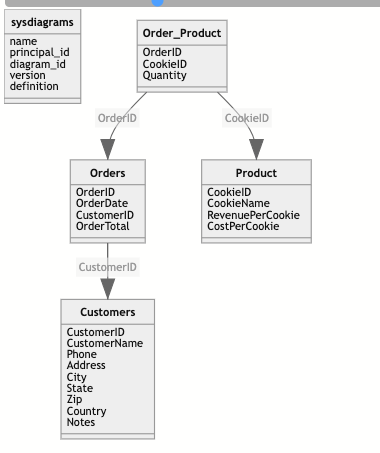
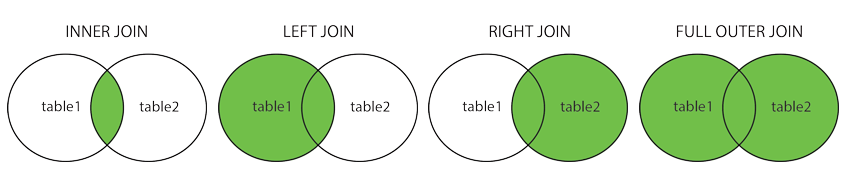

### Some vocabulary:

-   Normalization: It's the process of maintaining as less data as possible in a database. Benefit of doing so include saving space and easy tracking data.
-   Columns are called fields
-   Rows are called records
-   Primary Keys: They are the minimum numbers of columns to uniquely identify a row.

### Example Database Diagram

Database Name: KCC Four table Name: dbo.Orders, dbo.Customers, dbo.Order_Product, dbo.Product



### Select

1.  Select OrderID and CustomerID in Orders table, and rename CustomerID as Customer ID.

``` sql
Select OrderID, CustomerID as [Customer ID] from KCC.dbo.Orders
```

2.Select all columns in Orders table

``` sql
Select * from KCC.dbo.Orders
```

3.Display every customer Name in Customers table

``` sql
Select distinct CustomerName from KCC.dbo.Customers
```

4,.Select top 5 recods from Customers table

``` sql
Select top(5) * from KCC.dbo.Customers
```

### Filter (Giving some conditions)

1.Single conditions: Select customers records only customers lived in Washington from Cutomers table

``` sql
Select *
From KCC.dbo.Customers
where State = "WA"
```

\*Notes: equal sign is '=', unequal sign '!=' in sql.

2.Multiple conditions:

-   Select customers' records only customers lived in Washington, New York, and Uta from Cutomers table
-   Select customers' records only customers whose name is 'Tres Delicious' and live in either france or united states

``` sql
Select *
From KCC.dbo.Customers
where State IN('WA', 'NY', 'UT')

Select *
From KCC.dbo.Customers
where CustomerName = 'Tres Delicous' and (Country = 'France' or Country = 'United States')
```

3.Select customers' records only customers' name start with A

``` sql
Select *
From KCC.dbo.Customers
where CustomerName Like '%A'
```

4.Select customers' records only customers' name doesn't start with A

``` sql
Select *
From KCC.dbo.Customers
where CustomerName Not Like '%A'
```

### Join

1.(Inner)Join: only row that exists in both table 1 and 2 will be returned.

``` sql
Select OrderID, OrderDate, OrderTotal, CustomerName, Phone
From KCC.dbo.Orders o
Inner Join  KCC.dbo.Customers c  on o.CustomerID = c.CustomerID
```

2.LEFT (OUTER) JOIN: Returns all records from the left table, and the matched records from the right table

3.RIGHT (OUTER) JOIN: Returns all records from the right table, and the matched records from the left table (In my example, might return a row in which customers without orders)

4.FULL (OUTER) JOIN: Returns all records when there is a match in either left or right table



### Order by

It is when you want to return a table with sorted values with your targeted columns.

``` sql
SELECT OrderID, OrderDate, OrderTotal, CustomerName, Phone 
From dbo.Orders o
Right outer Join dbo.Customers c on o.CustomerID = c.CustomerID
Order by  OrderTotal desc
## where desc is descending 
```

### Functions

1.  Dateadd(interval, increment, expression) In the exmaple below, Dateadd(MONTh, -1, getdate()) means the date set is one month before than now.

2.  Count(\*) This counts number of rows

3.  Sum(OrderTotal) Return sum of the OrderTotal's value

4.  Group by Return selected columns with group based on targeted columns

``` sql
select * from dbo.Orders where OrderDate >= Dateadd(MONTH, -1, getdate())
select count(*) from dbo.Orders
select sum(OrderTotal) from dbo.Orders
select * from dbo.Orders group by CustomerID
```

##### Reference

1.  The Youtube video I reference on [SQL for Beginner by Kevin Stratvert](https://www.youtube.com/watch?v=h0nxCDiD-zg)

2.  The database KCC I used in the example [KCC database download link to follow along](https://onedrive.live.com/?authkey=%21AGGtzPTtFEqtVoU&id=B09F9559F6A16B6C%2177197&cid=B09F9559F6A16B6C&parId=root&parQt=sharedby&parCid=B5D0CE9C428470B4&o=OneUp)
