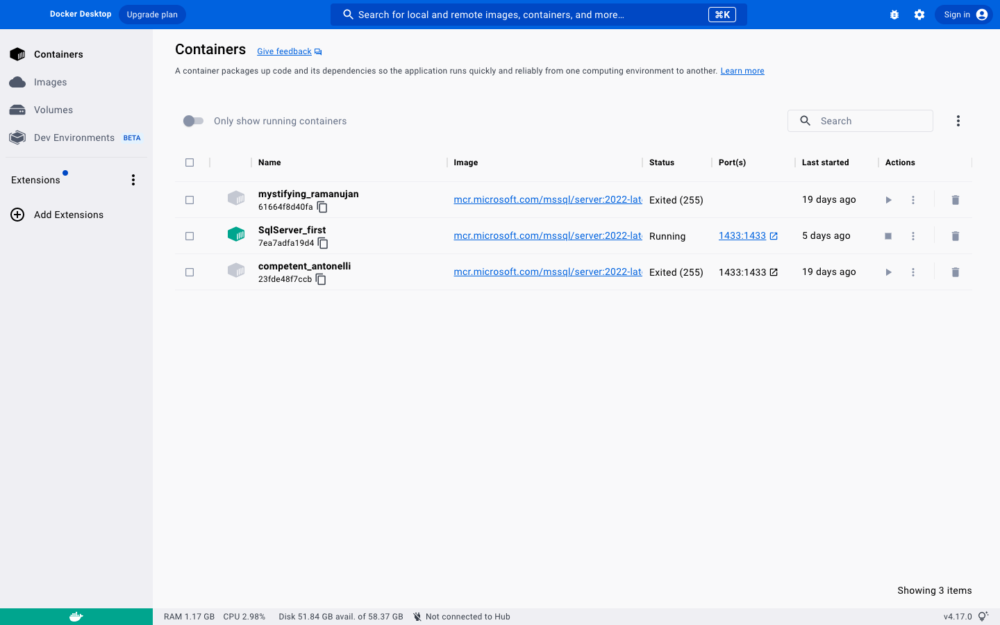

## docker cp

Notes: This is the note about how to use command line to restore .bak file in your local computer to docker.

### Example of *docker cp*

First, the example of the command to copying file should look like the following,

``` bash
#example 
docker cp /Users/nicoleyu/Desktop/mysql/SampleDatabase.bak SqlServer_first:/var/backups
```

### General Form

And when you search for *docker cp*, you will find the bellow command from the official document.

``` bash
docker cp [OPTIONS] CONTAINER:SRC_PATH DEST_PATH|-
docker cp [OPTIONS] SRC_PATH|- CONTAINER:DEST_PATH
# where cp means copying file between container and local filesystem
```

#### Explain

1.  SRC_PATH: This is the path of your .bak file was stored on your local computer. In my example, the file was stored inside my Desktop \> mysql folder.

2.  CONTAINER: It is the name of your docker's container which you wish to run with your current database. You can find the name in either the Container page on your docker dashboard (See Figure 1) or running the following command line in your computer terminal. So in my example, my container's name is SqlServer_first.

{width=80%} 


```{bash}
docker ps 
# This command shows the container that is currently running 
```


3. DEST_PATH: It is the path of your destination of the file you are copying from your local computer to the docker. You have to options to find the your DEST_PATH. First, go to the docker's container page, and click the three dot beside the current running container, then click *view file*. You will see the filesystem in your container, and choose one folder. Copy the file path. Second option in go to the AZure studio, connection page(left panel)\>Home\>Restore\> Restore from backup file \> Backup file path then click the three dot on the right. You will see the filesystem in your container, choose one. Then copy the selected path. In my exmaple, the *DEST_PATH is /var/backups*.

### Result

After running the docker cp, you will find the your bak.file under the database folder on the Azure studio.


\
\
\


